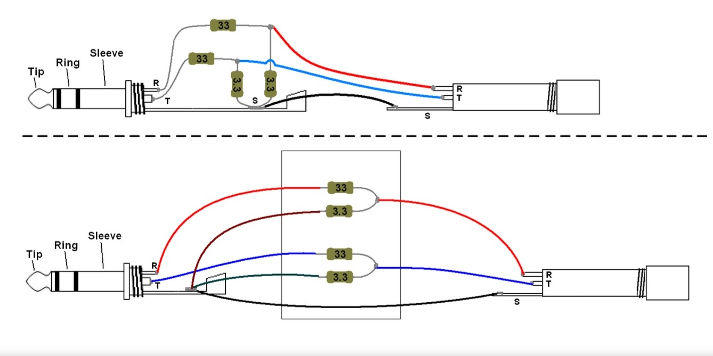

<h1> DeHisser4IEM </h1>
<strong> !!! The .gbr files included within version 0.1 were never acutally produced or tested in real life. Please check the specifications of your pcb manufacturer first. !!! </strong>

<h3> Description </h3>
This device is made to remove the hissing noise of low impedance headphones like IEMs when used with high power audio devices. The cirquit is meant to have a input and output, so that the device can be plugged in between the audio device and headphones. 
 

T = Tip = left channel 

R = Ring = rigth channel 

S = Sleeve = ground
